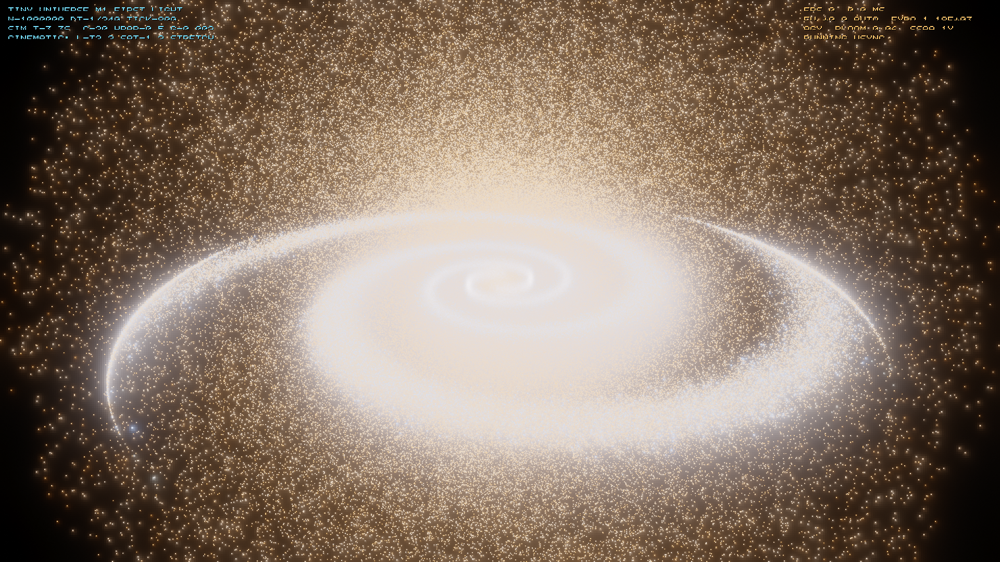
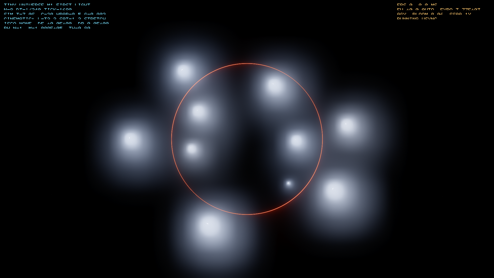
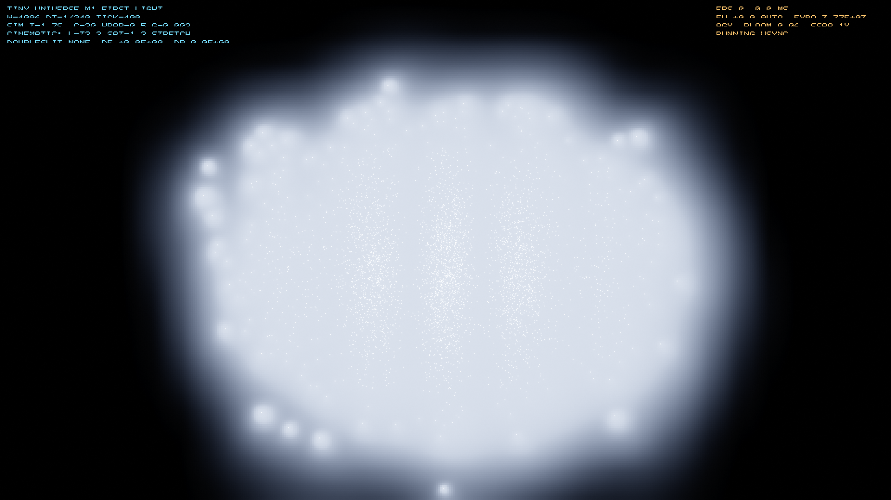
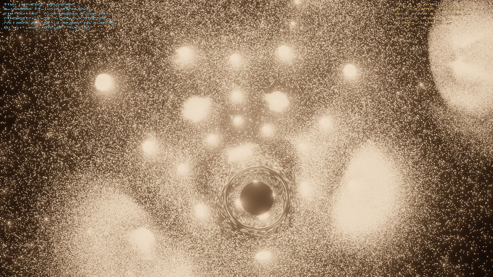

# TINY UNIVERSE

**A scale-compressed physics sandbox: quantum → Newtonian → relativistic → black-hole physics all emerge from particle count, a screen-zoom apart, on one GPU. Native Windows, C/C++/CUDA, no browser — one binary that is both a cinematic real-time universe and a deterministic, golden-gated physics instrument where every claim is reproducible.**


> The Insta360 "tiny planet" effect bends a flat neighborhood into a whole globe. Tiny Universe does that to physics: retune ħ (up), c (down), G (up) so the crossovers that nature spreads across ~60 orders of magnitude all happen between 1 and ~10⁶ particles — a range one GPU actually simulates. One lone particle is visibly a wave. A hundred decohere into billiards. Ten thousand self-bind. A hundred thousand collapse into a black hole that lenses the sky and evaporates in Hawking fireworks, because here ħ is big. **Nothing switches modes:** the regimes *emerge* from count, density, and speed, the way they do in nature — just closer together.

**Status:** v1 milestones **M0–M7 complete** · v2 substrate ladder **N0–N3 complete** — with the lapse (N2) and curved geometry (N3), **all four classical tests of GR pass on the substrate's own metric** (redshift · light-bending · precession · Shapiro) — plus the 2.5PN inspiral oracle, the Q-006 precession resolution, the **fluid-CSS critical-exponent crown — β measured** (0.3557988 vs the literature's 0.35580192, on the true Evans–Coleman background, D-032), and the **Choptuik exponent measured directly** — **γ = 0.37 ± 0.02** by supercritical mass scaling with the fine-structure wiggle detected in-house (`choptuik_nexus`; the ±0.001 crown precision is honestly AMR-gated, a boundary measured three independent ways). **The renderer axis is unparked**: R0 `interop` presents CUDA pixels through Vulkan zero-copy (external memory + timeline semaphores, validation-clean, golden-gated), and **R1 `cinematic` puts the full CINEMATIC post-chain on it** — HDR mip-bloom, energy-weighted auto-exposure, AgX, dithered sRGB — demoed by a blackbody-physical supernova that blinds and re-adapts the camera. **44/44 goldens green.** Built on a shared, sibling GPU with a 4070 Ti SUPER (16 GB), CUDA 13.1, `sm_89`.

---

## Gallery

Every image below is a real frame from the app, rendered entirely in CUDA (HDR → mip bloom → auto-exposure → AgX/ACES → dither), gated by [`CINEMATIC.md`](CINEMATIC.md).

| | |
|---|---|
|  **First light** — 1,000,000 stars, 499 fps |  **Gargantua** — a black hole lenses its own Hawking glow into an Einstein ring |
|  **Planck** — interference built one particle at a time; it *dies* when a which-way detector watches |  **Cosmos** — the 3-torus universe as a globe, wrapped and self-lensed |

## The two faces, one binary

`tinyuniverse.exe` is a windowed real-time app by default, and a **headless, contract-bounded instrument** with flags:

```
tinyuniverse.exe --scenario doubleslit --golden      # hash the declared state, compare to the frozen golden
tinyuniverse.exe --scenario galaxy --bench 300        # windowed, 1M particles, fps stats
tinyuniverse.exe                                      # just open the universe
```

The seam between the simulation core (deterministic, golden-gated, oracle-checked) and the renderer (a client) is the **frame contract**. Visuals and timing are *non-declared*; physics is sacred. Same dials + seed + input trace ⇒ byte-identical declared state.

## The ladder — what's built, and one receipt each

| milestone | what became real | a signature result (reproducible) |
|---|---|---|
| **M0 nexus** | the composition proof — all four regimes step together in fp64 without contradiction | 11-test analytic battery, the standing oracle |
| **M1 canvas** | first light — the CINEMATIC stack in pure CUDA | 1M stars @ **499 fps**, CINEMATIC checklist 10/10 |
| **M2 newton** | the universe gravitates — 128³ PM (fixed-point CIC → cuFFT Poisson) | two-body Kepler to <1e-6 over 10⁶ ticks; **347 fps** at 1M gravitating |
| **M3 arrow** | thermodynamics + the inscription (Ratchet) decoherence mechanic | the **Loschmidt echo is exact**: entropy 14.084 → 14.570 → 14.084 on time-reversal |
| **M4 einstein** | relativity, always-on — γ, proper time, light bending | relativistic precession vs the exact Sommerfeld formula to 0.5% |
| **M5 gargantua** | black holes as real entities — unscripted formation, Hawking evaporation | a 10⁶-particle cloud collapses to a BH **unscripted**; evaporates on the analytic clock |
| **M6 planck** | quantum mechanics is real — a split-step ψ engine | **the measurement problem, gated**: fringe contrast 0.83 → 0.052 under which-way detection |
| **M7 cosmos** | the tiny planet — 3-torus wrap, light-history, stereographic projection | a photon laps the universe twice and returns to 3×10⁻⁵ su; EdS cosmology growth to 1% |
| **v2 N0 substrate** | the substrate oracle — a CPU fp64 spherical Einstein–Klein–Gordon solver | the **Choptuik Type-II critical transition**: black holes forming with mass → 0 at threshold |
| **v2 N1–N3 field→lapse→curve** | the GPU substrate ladder — the ψ-field gravity weld, the clock, curved geodesics | **all four classical tests of GR from the substrate's own metric**: exact Schwarzschild redshift, light bends 4GM/bc² (the 1919 factor of 2 decomposed), precession 0.52%, Shapiro 0.33%; an SP soliton scale-covariant to 3×10⁻⁸ |
| **crowns + polish** | 2.5PN inspiral (Peters 1964) · Q-006 resolved · **the fluid-CSS critical exponent, COMPLETE** | binaries merge on the quadrupole clock to 1.3×10⁻¹³; **β = 0.3557988 measured** (lit. 0.35580192) from the true Evans–Coleman background + its relevant eigenvalue, with two analytic gauge controls — after a three-session wall that turned out to be the *Friedmann solution masquerading as Evans–Coleman* (D-032): measured, caught, corrected |

Details live in [`ARCHITECTURE.md`](ARCHITECTURE.md) (the spec), [`DECISIONS.md`](DECISIONS.md) (every design call and every honest retraction), and [`TASKLIST.md`](TASKLIST.md).

## Build & verify it yourself

Toolchain (pinned in [`BUILD.md`](BUILD.md)): **CUDA 13.1**, `-arch=sm_89` (RTX 40-series), **MSVC 2022**. No fast-math in declared paths — an accelerated path ships with a paired-oracle error bound or it doesn't ship.

```bat
:: build (from an x64 Native Tools prompt)
nvcc -O3 -arch=sm_89 -Xcompiler "/O2" -o build\tinyuniverse.exe ^
     app\tinyuniverse.cu core\lib\envelope.cpp user32.lib gdi32.lib opengl32.lib cufft.lib

:: verify every physics claim cold — 39/39 green (~20 min; CPU-only oracle block ~1 min)
python harness\verify.py
```

The CPU oracles (`nexus`, `substrate_nexus`) run with no GPU at all. That's the whole point: **the goldens are a standing receipt a stranger can check.**

## The doctrine

> **The spec is the product. The contract is sacred. The golden is load-bearing. The code is ephemeral.**

Deterministic or it doesn't ship. Every physics module names its oracle (analytic or the fp64 `nexus`). Regimes emerge; nothing hard-switches. Beauty is a spec ([`CINEMATIC.md`](CINEMATIC.md)), not an accident. And honesty is enforced: when a claim doesn't survive measurement, it is *withdrawn and logged*, not massaged — see D-016 (a beautiful 7π precession claim, retired at 6.41π) and D-021 (why the precise Choptuik exponent is deferred, not faked).

## Ecosystem

Tiny Universe is the **gamified, playable sibling** of a small governed-simulation family — same doctrine (contract-first, deterministic, golden-gated), less dry:

- **[ORRERY](https://github.com/bochen2029-pixel/ORRERY)** — the headless instrument: golden-gated CUDA/C++/Python tools you *call* to put a theory's claims to a measured test. Tiny Universe lifts its deterministic core (`liborrery`) verbatim.
- **[The Unfinished Mirror](https://github.com/bochen2029-pixel/final-theory-of-everything)** ([finaltheoryofeverything.org](https://finaltheoryofeverything.org)) — the theory ORRERY serves; its §6 inscription mathematics is the source of this engine's Ratchet decoherence mechanic. Tiny Universe *renders mechanisms and proves structure*; it takes no metaphysical position.
- Quarries: [buddhabrot-cuda](https://github.com/bochen2029-pixel/buddhabrot-cuda) (the one-binary-two-faces, two-stream pattern) and [astra-7](https://github.com/bochen2029-pixel/astra-7) (the nexus / regime-composition pattern).

## Built with Claude

This engine was built by an AI (Claude) under a human's direction, behind machine-checkable gates — the commit history reads like a lab notebook, one milestone per commit, honest retractions included. The governance that makes that trustworthy *is* the doctrine above: no claim ships without a golden a stranger can run cold.

## What's next

v2 **SUBSTRATE** — a one-field rewrite where the quantum↔classical boundary becomes a dial instead of a code path, aimed at the physics v1 rendered *beside* each other rather than fused. The hard problems there (resolving the Choptuik exponent, BSSN stability at toy dials) are being attacked with a novel **adversarial AI-tournament methodology** — diverse approach-personas, cross-examined and armed with ORRERY to make every claim evidence-grade. That research branch will land here as it matures.

## License

[MIT](LICENSE) © 2026 Bo Chen. Use it, fork it, learn from it.
